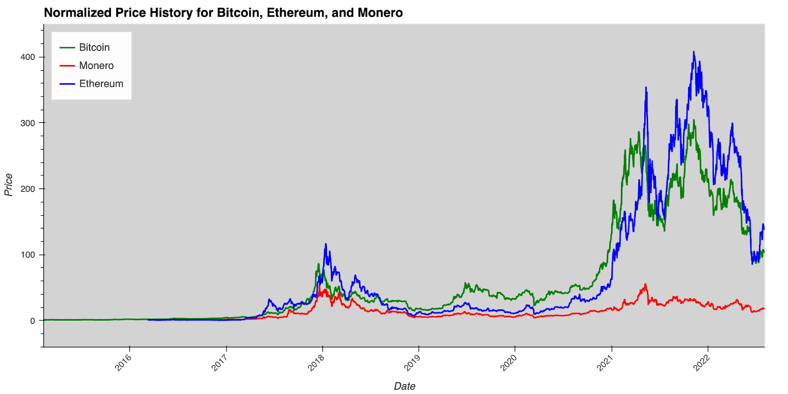
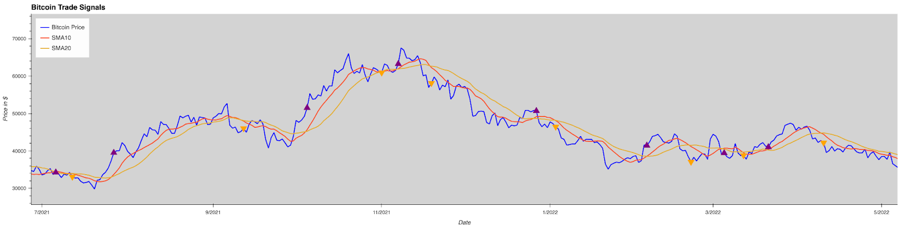
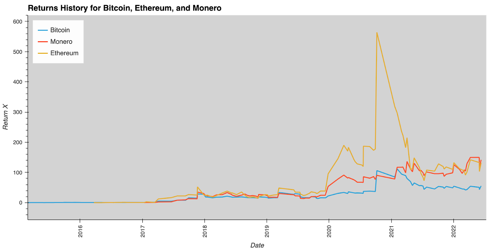

# Crypto Quant Trading
## About
Volatile crypto’s that are correlated with BTC can return greater profits through active trading using BTC as a broad market signal. In this project, BTC is used as the most efficient cryptocurrency. By using pure technical analysis of SMA, we determine the trading signal for longing and shorting decisions. Cumulative returns are calculated to test efficiency and profitability of trading crypto's with this approach.

## SMA Approach

There is a strong correlation in the Crypto Market.


By comparing 10-day moving average with 20-day moving average, long and short signals are determined. 
* Purple arrows: exit short trade and execute long. 
* Orange arrows: exit long trade and execute short.

## Results

Monero (XMR) and Ethereum (ETH) provide greater returns than Bitcoin and yield 141.8271x and 132.0413x respectively

---
## Technologies 
### This project leverages python 3.7 with the following packages:

* [pandas](https://github.com/pandas-dev/pandas) - For data analysis 

* [pathlib](https://docs.python.org/3/library/pathlib.html) - For reading file paths

* [glob](https://docs.python.org/3/library/glob.html) - To iterate over multiple file paths

* [plotly](https://github.com/plotly/plotly.py) - To create interactive plots

* [numpy](https://github.com/numpy/numpy) - For scientific computing

* [hvPlot](https://github.com/holoviz/hvplot) - To create interactive plots
---
## Installation Guide 
Before running the application first install the following dependencies.

**Plotly**

Use the package manager [pip](https://pip.pypa.io/en/stable/) to install Plotly:

```python
  pip install plotly==5.10.0
```

**hvPlot**

Use the package manager [pip](https://pip.pypa.io/en/stable/) to install hvPlot:

```python
  pip install hvplot
```

---
## Usage 

To run the Crypto_Quant_Trading analysis files you must first clone the repository to your local machine:

```python
git clone <paste link here>
```
* Data collection, cleaning, and concatenation was done in the ```Bitfinex_Data.ipynb``` file 
* For ease of use the cleaned and concatenated CSV files have already been saved in the repository as ```Bitcoin_Data.csv``` and ```Coins_Data_Master.csv```

Open the ```data.ipynb``` file and run to view the data analysis and graphics 
  
<br>

---

### Contributors 

Abhir Mehra
* abhirmehra5@gmail.com
* [LinkedIn](https://www.linkedin.com/in/abhir-mehra/)

Cole Frederick
* fredec96@gmail.com
* [LinkedIn](https://www.linkedin.com/in/cole-frederick-085982b0/)

Josh Thompkins
* joshuathompkins07@gmail.com
* [LinkedIn](https://www.linkedin.com/in/rebekah-lin/)

Rebekah (Libaijia) Lin
* rebekah.lin.28@gmail.com
* [LinkedIn](https://www.linkedin.com/in/joshua-thompkins/)

Sebastian Sandoval
* ssandoval1994r@gmail.com
* LinkedIn
